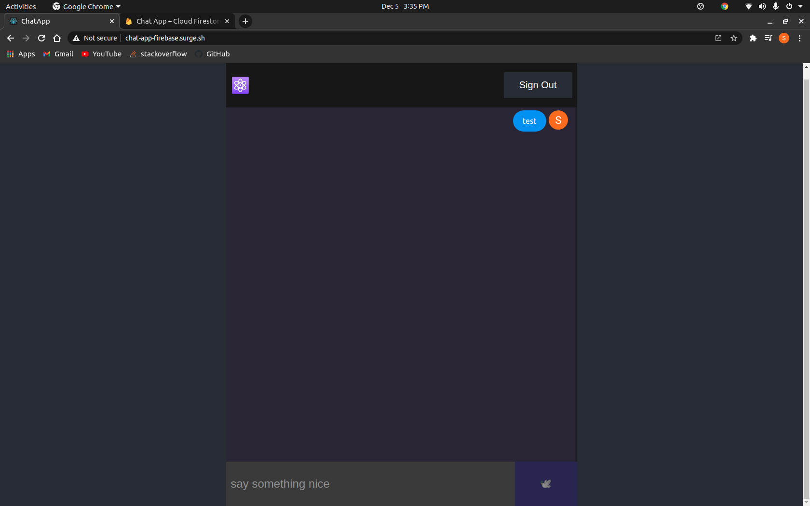
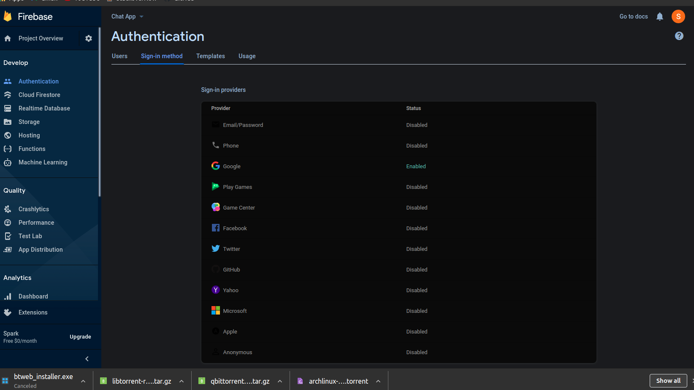

# ChatApp

This is a chat web application made using ReactJS and the Firebase module. The demo site has been taken down, you can host it on your own

# Prerequisites
Please install the following modules in your project directory if you wish to run it on local host!
<code>npm install firebase react-firebase-hooks</code>

Then go to https://console.firebase.google.com/ and create a new project. Inside your project go to authentication and then sign-in method and enable google sign in 

After that go to your project settings and create a new app. Copy the firebase.config data In App.js put that data in the firebase.initializeApp function

Here is a video

# npm run
run this command if you want to run the web app

# npm build
run this if you want to make a production build
